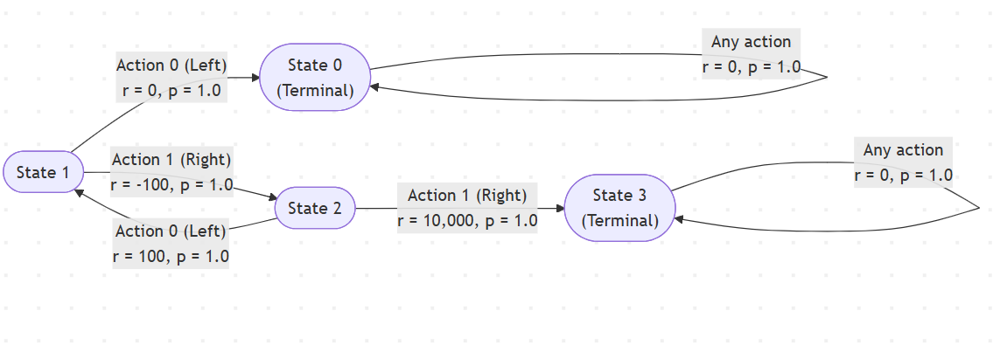

# Assignment: TRY THIS OUT

Suppose $\pi_i$ and $\pi_{i+1}$ are two greedy policies you get from value iteration. True or False: $\pi_{i} \leq \pi_{i+1}$.

## FALSE

We know that, $\pi_{i} \leq \pi_{i+1}$ is true if and only if $v_{\pi_i}(s) \leq v_{\pi_{i+1}}(s)$, $\forall s \in \mathcal{S}$.

I can construct a counterexample to show that this is not always the case. 

## MDP Structure

| State | Action | Next State | Reward | Probability | Terminal |
|-------|--------|-----------|--------|-------------|----------|
| 1 | 0 (Left) | 0 | 0 | 1.0 | Yes |
| 1 | 1 (Right) | 2 | -100 | 1.0 | No |
| 2 | 0 (Left) | 1 | 100 | 1.0 | No |
| 2 | 1 (Right) | 3 | 10,000 | 1.0 | Yes |
| 0 | Any | 0 | 0 | 1.0 | Yes |
| 3 | Any | 3 | 0 | 1.0 | Yes |

**Visual Flow:**



```{python}
from typing import Optional
import gymnasium as gym
import numpy as np

# MDP I seek to Construct:
# (0 | R=0, Terminal) --<-(1/2)-- (1 | R=100) <-(1/2)---(1/2)--> (2 | R=-100) ----(1/2)--> (3 | R=10,000, Terminal)

class MDPEnvironment(gym.Env):
    def __init__(self):
        self.action_space = gym.spaces.Discrete(2)
        self.observation_space = gym.spaces.Discrete(4)
        self.state = 1
        self.terminal_states = {0, 3}

        # P[s][a] = list of (prob, next_state, reward, terminated)
        self.P = {
            0: {0: [(1.0, 0, 0.0, True)],    1: [(1.0, 0, 0.0, True)]},
            1: {0: [(1.0, 0, 0.0, True)],    1: [(1.0, 2, -100.0, False)]},
            2: {0: [(1.0, 1, 100.0, False)], 1: [(1.0, 3, 10000.0, True)]},
            3: {0: [(1.0, 3, 0.0, True)],    1: [(1.0, 3, 0.0, True)]},
        }

    def reset(self, seed: Optional[int] = None, options=None):
        super().reset(seed=seed)
        self.state = 1
        return self.state, {}

    def step(self, action):
        prob, next_state, reward, terminated = self.P[self.state][action][0]
        self.state = next_state
        truncated = False
        return next_state, reward, terminated, truncated, {}
```

```{python}
env = MDPEnvironment()
```

# Value Iteration

```{python}
def action_value_iteration(env, gamma=1.0, theta=1e-10, max_iters=10000):
    nS, nA = env.observation_space.n, env.action_space.n
    Q = np.zeros((nS, nA), dtype=float)
    Q[1, 0] = 10000.0  # Initialize Q(1, L) to a high value to encourage exploration
    Q[1, 1] = 0
    Q[2, 0] = 0
    Q[2, 1] = -100.0

    q_history = []

    for _ in range(max_iters):
        delta = 0.0
        Q_new = Q.copy()

        for s in range(nS):
            for a in range(nA):
                q_sa = 0.0
                for p, s_next, r, terminated in env.P[s][a]:
                    bootstrap = 0.0 if terminated else np.max(Q[s_next])
                    q_sa += p * (r + gamma * bootstrap)

                delta = max(delta, abs(q_sa - Q[s, a]))
                Q_new[s, a] = q_sa

        q_history.append(Q_new.copy())
        Q = Q_new
        if delta < theta:
            break

    q_history_updated = []
    for q in q_history:
        q_history_updated.append(q[1:3, :])  # Only keep Q-values for states 1 and 2

    return Q, q_history


def greedy_policy_from_Q(Q, terminal_states=None):
    nS, nA = Q.shape
    terminal_states = set() if terminal_states is None else set(terminal_states)
    policy = np.zeros((nS, nA), dtype=float)

    for s in range(nS):
        if s in terminal_states:
            policy[s] = np.ones(nA) / nA
            continue
        best_a = np.argmax(Q[s])
        policy[s, best_a] = 1.0
    return policy


# Run
Q, q_hist = action_value_iteration(env, gamma=0.999, max_iters=10000)
pi_greedy = greedy_policy_from_Q(Q, terminal_states={0, 3})

# print("Final Q:\n", Q)
# print("Greedy policy (rows=states, cols=[L,R]):\n", pi_greedy)

# If you name states/actions as A=1, B=2 and L=0, R=1:
# A, B = 1, 2
# L, R = 0, 1
# print(f"Q(A, L) = {Q[A, L]:.6f}")
# print(f"Q(B, L) = {Q[B, L]:.6f}")
# print(f"Q(A, R) = {Q[A, R]:.6f}")
# print(f"Q(B, R) = {Q[B, R]:.6f}")

for i, q in enumerate(q_hist):
    print(f"Iteration {i+1}:")
    print(f"  Q(State 1): {q[1]}")
    print(f"  Q(State 2): {q[2]}")
    pi_greedy_iter = greedy_policy_from_Q(q, terminal_states={0, 3})
    print(f"  Policy(State 1): Action {np.argmax(pi_greedy_iter[1])} (prob: {pi_greedy_iter[1]})")
    print(f"  Policy(State 2): Action {np.argmax(pi_greedy_iter[2])} (prob: {pi_greedy_iter[2]})")
    print()
```

# Iterative Policy Evaluation

_To evaluate the greedy policies obtained by value iteration_

```{python}
def iterative_policy_evaluation(env, policy_func, gamma=1.0, theta=1e-6, max_iters=10000):
    nS, nA = env.observation_space.n, env.action_space.n
    V = np.zeros(nS, dtype=float)
    terminal_states = {0, 3}
    intermediate_values = []

    for _ in range(max_iters):
        delta = 0.0
        V_new = V.copy()

        for s in range(nS):
            if s in terminal_states:
                continue

            probs = policy_func(s)
            v_temp = 0.0
            for a in range(nA):
                for p, s_next, r, terminated in env.P[s][a]:
                    v_temp += probs[a] * p * (r + gamma * (0.0 if terminated else V[s_next]))

            delta = max(delta, abs(v_temp - V[s]))
            V_new[s] = v_temp

        intermediate_values.append(V_new.copy())
        V = V_new

        if delta < theta:
            break

    return V, intermediate_values
```

```{python}
def policy_func_1(state):
    if state == 1:
        return [1.0, 0.0]   # always action 0
    if state == 2:
        return [1.0, 0.0]   # always action 0
    return [0.5, 0.5]       # unused for terminal states

def policy_func_2(state):
    if state == 1:
        return [0.0, 1.0]   # always action 1
    if state == 2:
        return [0.0, 1.0]   # always action 1
    return [0.5, 0.5]       # unused for terminal states

def policy_func_3(state):
    if state == 1:
        return [0.0, 1.0]   # always action 1
    if state == 2:
        return [1.0, 0.0]   # always action 0
    return [0.5, 0.5]       # unused for terminal states

def policy_func_4(state):
    if state == 1:
        return [1.0, 0.0]   # always action 0
    if state == 2:
        return [0.0, 1.0]   # always action 1
    return [0.5, 0.5]       # unused for terminal states

V1, intermediate_values_1 = iterative_policy_evaluation(env, policy_func_1, gamma=0.999)
V2, intermediate_values_2 = iterative_policy_evaluation(env, policy_func_2, gamma=0.999)
V3, intermediate_values_3 = iterative_policy_evaluation(env, policy_func_3, gamma=0.999)
V4, intermediate_values_4 = iterative_policy_evaluation(env, policy_func_4, gamma=0.999)
```

```{python}
print("Policy 1 (Always action 0):")
for values in V1:
    print(values)

print("---")

print("Policy 2 (Always action 1):")
for values in V2:
    print(values)

print("---")

print("Policy 3 (Action 1 for state 1, Action 0 for state 2):")
for values in V3:
    print(values)

print("---")

print("Policy 4 (Action 0 for state 1, Action 1 for state 2):")
for values in V4:
    print(values)
```

# Explanation

## Description of the MDP

I have constructed an MDP with 4 states: 0, 1, 2, and 3. State 0 and State 3 are terminal states.
- From State 1, taking Action 0 (Left) leads to State 0 with a reward of 0, while taking Action 1 (Right) leads to State 2 with a reward of -100.
- From State 2, taking Action 0 (Left) leads back to State 1 with a reward of 100, while taking Action 1 (Right) leads to State 3 with a reward of 10,000.

## Value Iteration and Policy Evaluation

Then, using action-value iteration, we can compute the value functions for each state starting with initial values. 

### Initital Values

-  $Q[1, 0] = 10000.0$
-  $Q[1, 1] = 0$
-  $Q[2, 0] = 0$
-  $Q[2, 1] = -100.0$
-  $Q[0, 0] = 0$
-  $Q[0, 1] = 0$
-  $Q[3, 0] = 0$
-  $Q[3, 1] = 0$

### Optimal Policy

The optimal policy, from by observation of the reward structure, would be:
- $\pi(1) = 1$ (Right)
- $\pi(2) = 1$ (Right)

### Iterations

Now, let's consider the greedy policies $\pi_i$ and $\pi_{i+1}$ obtained from value iteration.

**Iteration 1:**
- $\pi_1(1) = 0$ (Left) & $\pi_1(2) = 0$ (Left)
- $v_{\pi_1}(1) = 0$ (since it leads to terminal state with reward 0)
- $v_{\pi_1}(2) = 100$ (since it leads back to state 1 with reward 100)

**Iteration 2:**
- $\pi_2(1) = 1$ (Right) & $\pi_2(2) = 1$ (Right)
- $v_{\pi_2}(1) = 9890$
- $v_{\pi_2}(2) = 10000$ (since it leads to terminal state with reward 10,000)

**Iteration 3:**
- $\pi_3(1) = 0$ (Right) & $\pi_3(2) = 1$ (Left)
- $v_{\pi_3}(1) = -50$ 
- $v_{\pi_3}(2) = 50$

**Iteration 4:**
- $\pi_4(1) = 1$ (Right) & $\pi_4(2) = 1$ (Right)
- $v_{\pi_4}(1) = 9890$
- $v_{\pi_4}(2) = 10000$


## **Conclusion**
I have shown that policies obtained from value iteration needn't be monotonically improving. In this example, $\pi_3$ is not better than $\pi_2$ because $v_{\pi_3} < v_{\pi_2}$. Therefore, the statement $\pi_{i} \leq \pi_{i+1}$ is false.

